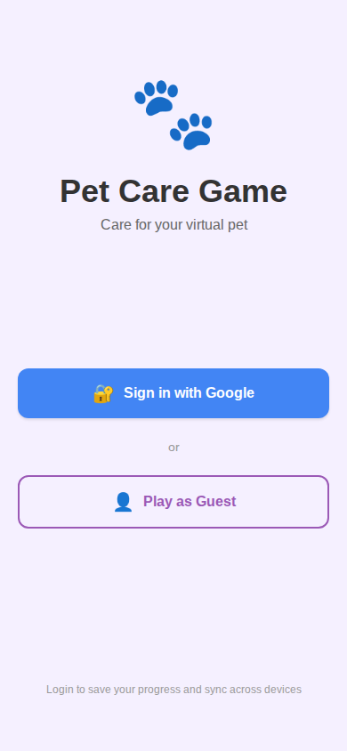
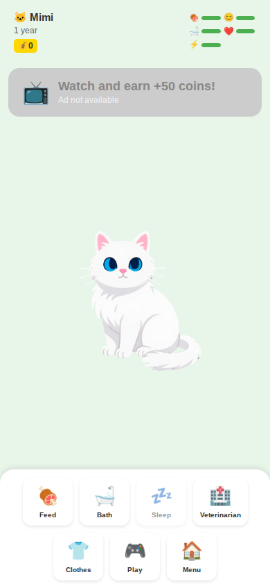
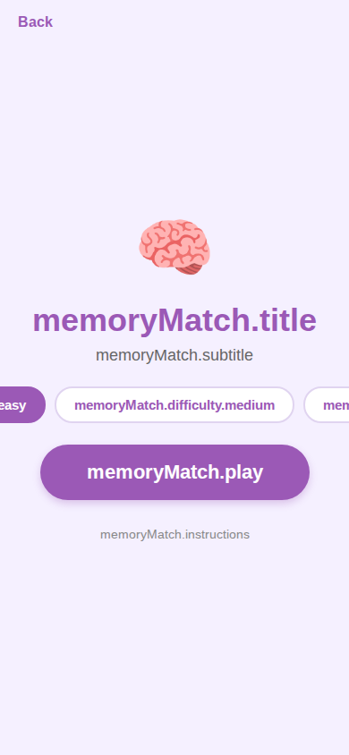

# Game Screenshots Memory

This file centralizes the current game screen screenshots for CI/Claude project memory.

## Login Screen

## Game Selection Screen

## Game Start Screens

### Pet Care

### Muito

### Color Tap

### Memory Match

### Pet Runner

