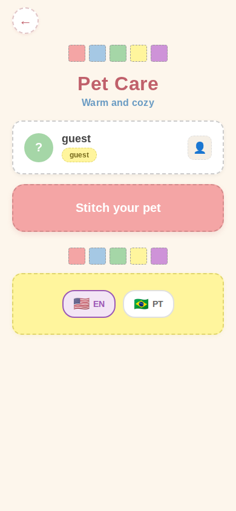

# MenuScreen

> Main pet management menu with patchwork/quilt visual theme.
> Source: `src/screens/MenuScreen.tsx`



---

## Layout Structure

```
┌────────────────────────────────┐
│          SafeAreaView          │
│     bg: #fdf6ec (warm cream)   │
│                                │
│  ← Back (circle, dashed)       │
│                                │
│  ■ ■ ■ ■ ■  Quilt Strip       │  5 colored squares
│                                │
│  ┌──────────────────────────┐  │
│  │     "Pet Care"  #c0606b  │  │  32px, weight 800
│  │   "subtitle"  #6a9bc3   │  │  16px, weight 600
│  └──────────────────────────┘  │
│                                │
│  ┌──────────────────────────┐  │
│  │  Profile Card (dashed)   │  │  white, dashed border
│  │  [Avatar] Name    [🚪]  │  │
│  │           Guest badge    │  │
│  └──────────────────────────┘  │
│                                │
│  ┌──────────────────────────┐  │
│  │  ❤️  Pet Name     →     │  │  Hero card (blue/pink)
│  └──────────────────────────┘  │
│                                │
│  + Create New Pet (link)       │  conditional
│                                │
│  ■ ■ ■ ■ ■  Quilt Strip       │
│                                │
│  ┌──────────────────────────┐  │
│  │  Language Card (yellow)  │  │  dashed border
│  └──────────────────────────┘  │
│                                │
│  Delete Account (link)         │  conditional
└────────────────────────────────┘
```

---

## Visual Theme: Patchwork / Quilt

This screen uses a unique **patchwork quilt** aesthetic different from other screens:
- **Dashed borders** on cards (`borderStyle: 'dashed'`, `borderWidth: 1.5-2`)
- **Warm color palette**: cream, rose, soft blue, green, yellow
- **Quilt strip decorations** with colored squares

### Quilt Strip Colors
```
#f4a5a5  #a5c8e4  #a5d6a7  #fff59d  #ce93d8
 (pink)   (blue)  (green)  (yellow) (purple)
```

---

## Specifications

### Container
- **Background**: `#fdf6ec` (warm cream)
- **ScrollView padding**: horizontal `20px`, bottom `40px`, top `12px`

### Back Button
- **Size**: `44x44px`, border radius `22px`
- **Background**: `#ffffff`
- **Border**: `2px` dashed `#e0c4c6`
- **Shadow**: color `#c0606b`, offset `{0, 2}`, opacity `0.1`
- **Icon**: arrow-left, `22px`, color `#c0606b`

### Quilt Strip
- **Layout**: row, centered, gap `6px`, marginVertical `14px`
- **Square**: `28x28px`, border radius `4px`, border `1.5px` dashed `#999`

### Title Section
- **Title**: `32px`, weight `800`, color `#c0606b`, letterSpacing `0.5`
- **Subtitle**: `16px`, weight `600`, color `#6a9bc3`, marginTop `4px`, letterSpacing `0.3`

### Profile Card
- **Background**: `#ffffff`
- **Border radius**: `16px`
- **Border**: `2px` dashed `#cccccc`
- **Padding**: `18px`
- **Shadow**: offset `{0, 2}`, opacity `0.06`, radius `6`, elevation `2`

#### Avatar Circle
- **Size**: `48x48px`, border radius `24px`
- **Default background**: `#a5d6a7` (green)
- **Initial text**: `20px`, weight `800`, color `#ffffff`

#### Profile Info
- **Name**: `18px`, weight `700`, color `#444444`
- **Email**: `12px`, color `#888`

#### Guest Badge
- **Background**: `#fff59d`
- **Border**: `1.5px` dashed `#e0d56c`
- **Border radius**: `12px`
- **Padding**: horizontal `12px`, vertical `4px`
- **Text**: `12px`, weight `700`, color `#7a6e1e`

#### Sign Out Button
- **Size**: `40x40px`, border radius `10px`
- **Background**: `#fdf0f0`
- **Border**: `1.5px` dashed `#e0c4c6`
- **Icon**: log-out, `18px`, color `#c0606b`

### Hero Card (With Pet)
- **Background**: `#a5c8e4`
- **Border**: `2px` dashed `#7a9fc0`
- **Border radius**: `20px`
- **Padding**: vertical `22px`, horizontal `24px`
- **Shadow**: color `#7a9fc0`, offset `{0, 4}`, opacity `0.2`, radius `8`
- **Layout**: row, centered (heart icon + name + chevron)
- **Text**: `20px`, weight `800`, color `#ffffff`

### Hero Card (No Pet)
- **Background**: `#f4a5a5`
- **Border**: `2px` dashed `#d48a8a`
- **Border radius**: `20px`
- **Padding**: vertical `26px`, horizontal `24px`
- **Text**: "Stitch Your Pet", `20px`, weight `800`, color `#ffffff`

### New Pet Link (when pet exists)
- **Layout**: row, centered, gap `8px`
- **Icon**: plus-circle, `18px`, color `#6a9bc3`
- **Text**: `14px`, weight `600`, color `#6a9bc3`

### Language Card
- **Background**: `#fff59d`
- **Border**: `2px` dashed `#e0d56c`
- **Border radius**: `16px`
- **Padding**: `18px`
- **Shadow**: color `#e0d56c`, offset `{0, 2}`, opacity `0.15`

### Delete Button
- **Text**: `14px`, weight `600`, color `#c0606b`
- **Padding**: vertical `14px`

---

## Modals

Three confirmation modals (ConfirmModal component):
1. **New Pet Confirm** - `confirmStyle: "destructive"`
2. **Delete Pet Confirm** - `confirmStyle: "destructive"`
3. **Sign Out Confirm** - `confirmStyle: "destructive"`

---

## States

| State | Visual |
|-------|--------|
| Pet exists | Hero card (blue), Continue + New Pet link + Delete shown |
| No pet | Hero card (pink), "Stitch Your Pet" only |
| Guest user | Guest badge shown, decorative patch instead of sign-out |
| Signed in | Email shown, sign-out button visible |
