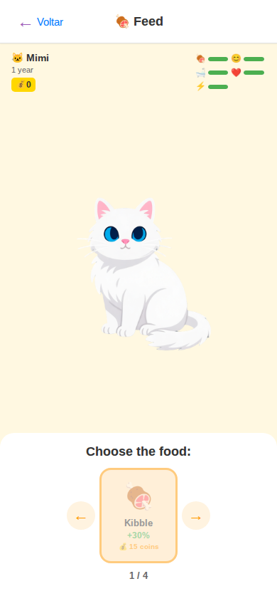

# FeedScene

> Feeding action screen with food carousel navigation.
> Source: `src/screens/FeedScene.tsx`



---

## Layout Structure

```
┌─────────────────────────────────┐
│           SafeAreaView          │
│      bg: #fff8e1 (warm yellow)  │
│                                 │
│  ┌───────────────────────────┐  │
│  │  ScreenHeader             │  │  white, bordered bottom
│  │  ← Voltar    🍖 Feed     │  │
│  └───────────────────────────┘  │
│                                 │
│  ┌───────────────────────────┐  │
│  │  StatusCard (compact)     │  │
│  └───────────────────────────┘  │
│                                 │
│  ┌───────────────────────────┐  │
│  │                           │  │
│  │      PetRenderer          │  │
│  │      (animated)           │  │
│  │                           │  │
│  │    "Yummy! +30%"          │  │  message (conditional)
│  └───────────────────────────┘  │
│                                 │
│  ┌───────────────────────────┐  │
│  │  Food Container (white)   │  │  rounded top corners
│  │  "Choose a food"          │  │
│  │                           │  │
│  │  ←  ┌──────────┐  →      │  │  navigation arrows
│  │     │  🍖      │         │  │  food item button
│  │     │  Kibble  │         │  │
│  │     │  +30%    │         │  │
│  │     │  💰 15   │         │  │
│  │     └──────────┘         │  │
│  │       1 / 4              │  │  page indicator
│  └───────────────────────────┘  │
└─────────────────────────────────┘
```

---

## Specifications

### Container
- **Background**: `#fff8e1` (warm amber/yellow)

### Screen Header
- Component: `ScreenHeader` (white bg, border-bottom)
- Title: Feed title from i18n
- Back button: navigates back

### StatusCard
- **Mode**: compact
- See `17-shared-components.md`

### Pet Container
- **Layout**: `flex: 1`, centered
- **Pet size**: ACTION_PET_SIZE (responsive)
  - Mobile: `280px`, Mobile Large: `340px`, Tablet: `400px`, Desktop: `450px`

#### Message Text (conditional)
- **Font**: responsive messageSize (`14-22px`)
- **Weight**: `600`
- **Color**: `#333`
- **Alignment**: center
- **Margin top**: `16px`

### Food Container
- **Background**: `#ffffff`
- **Border radius**: top `20px` (responsive)
- **Padding**: `16px` (responsive)

#### Section Title
- **Font**: responsive titleSize (`18-32px`)
- **Weight**: `600`
- **Color**: `#333`
- **Alignment**: center
- **Margin bottom**: `12px` (responsive)

### Navigation Container
- **Layout**: row, centered
- **Margin bottom**: `10px` (responsive)

#### Arrow Buttons
- **Background**: `#fff3e0` (light amber)
- **Shape**: circle (size/2 border radius)
- **Size**: responsive (`40-60px`)
- **Margin horizontal**: `6px` (responsive)
- **Arrow text**: `←` / `→`, responsive fontSize (`22-32px`), weight `bold`, color `#ff9800`

#### Current Food Button
- **Background**: `#ffe0b2` (amber light)
- **Border**: `3px` solid `#ff9800`
- **Border radius**: `16px` (responsive)
- **Padding**: responsive (`14-28px`)
- **Min width**: responsive (`110-180px`)
- **Alignment**: center
- **Opacity**: `0.5` when can't afford

##### Food Item Contents
- **Emoji**: responsive size (`36-56px`), marginBottom `6px`
- **Name**: responsive font (`13-20px`), weight `bold`, color `#333`
- **Value**: "+{value}%", responsive font (`12-16px`), weight `600`, color `#4CAF50`
- **Cost**: "💰 {cost} coins", responsive font (`10px` base), weight `600`, color `#ff9800`

### Page Indicator
- **Font**: `13px` (responsive), weight `600`, color `#666`
- **Alignment**: center
- **Margin bottom**: `12px`

---

## Food Items Data

| ID | Emoji | Name Key | Hunger Value | Cost |
|----|-------|----------|-------------|------|
| kibble | `🍖` | `feed.foods.kibble` | +30% | 15 coins |
| fish | `🐟` | `feed.foods.fish` | +35% | 20 coins |
| treat | `🦴` | `feed.foods.treat` | +25% | 18 coins |
| milk | `🥛` | `feed.foods.milk` | +20% | 15 coins |

---

## States

| State | Visual |
|-------|--------|
| Default | Food carousel visible, pet idle |
| Can't afford | Food button at 50% opacity |
| Hunger full | Food button disabled |
| Animating | Arrows disabled, pet animates, message shown |
| Post-action | DoubleRewardModal may appear |

---

## Interactions

- **Arrow press**: cycles through food carousel
- **Food button press**: triggers feed action with animation sequence
- **Disabled during animation**: arrows and food button disabled
- **Not enough money**: Alert dialog shown
