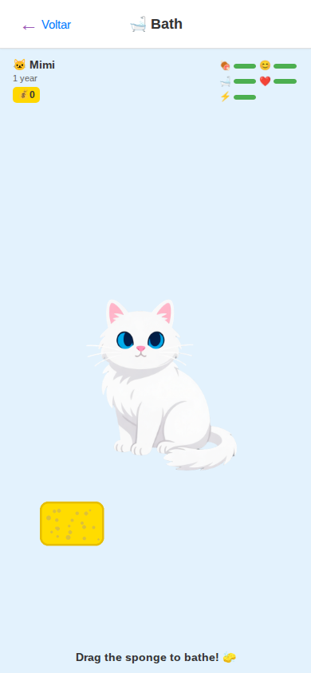

# BathScene

> Interactive bathing screen with gesture-based sponge scrubbing and bubble effects.
> Source: `src/screens/BathScene.tsx`



---

## Layout Structure

```
┌─────────────────────────────────┐
│           SafeAreaView          │
│      bg: #e3f2fd (light blue)   │
│                                 │
│  ┌───────────────────────────┐  │
│  │  ScreenHeader             │  │
│  │  ← Voltar    🛁 Bath     │  │
│  └───────────────────────────┘  │
│                                 │
│  ┌───────────────────────────┐  │
│  │  StatusCard (compact)     │  │
│  └───────────────────────────┘  │
│                                 │
│  ┌───────────────────────────┐  │
│  │  GestureDetector (pan)    │  │
│  │                           │  │
│  │      PetRenderer          │  │  Swipeable
│  │      (animated)           │  │
│  │                           │  │
│  │      🫧🫧🫧              │  │  Dynamic bubbles
│  └───────────────────────────┘  │
│                                 │
│  ┌────────────┐                 │
│  │  🧽 Sponge │  Draggable     │  Absolute positioned
│  └────────────┘                 │
│                                 │
│  ┌───────────────────────────┐  │
│  │  "Drag the sponge..."    │  │  Instruction/message
│  │  "Scrubbing 3/5"         │  │  Progress text
│  └───────────────────────────┘  │
└─────────────────────────────────┘
```

---

## Specifications

### Container
- **Background**: `#e3f2fd` (light blue)

### Pet Container (GestureDetector)
- **Layout**: `flex: 1`, centered, `position: relative`
- **Gesture**: Pan gesture with horizontal translation
  - Translation damping: `0.3` (translationX * 0.3)
  - Spring-back on end

### Pet Size
- Responsive via ACTION_PET_SIZE:
  - Mobile: `280px`, Mobile Large: `340px`, Tablet: `400px`, Desktop: `450px`

### Dynamic Bubbles
- **Emoji**: `🫧`, fontSize `32px`
- **Position**: absolute, offset from gesture position
  - Variance: `40px` random offset
  - Offset base: `20px`
- **Animation**: fade in (200ms) → fade out (1300ms), scale up 1.5x then to 0
- **Throttle**: minimum `100ms` between bubble creation
- **Velocity threshold**: `100` (only spawn when moving fast enough)
- **Auto-remove**: after `1500ms`

### Draggable Sponge
- **Image**: `assets/sprites/sponge.png`
- **Position**: absolute
- **Size** (responsive):
  - Mobile: `100x75px`, bottom `150px`
  - Mobile Large: `150x112px`, bottom `200px`
  - Tablet: `180x135px`, bottom `240px`
  - Desktop: `200x150px`, bottom `280px`
- **Left**: `40px`
- **zIndex**: `20`
- **Gesture**: Pan drag with spring-return
  - Active scale: `1.1` (spring)
  - Returns to origin on release

### Message Container
- **Padding**: `12px` (responsive)
- **Alignment**: center

#### Instruction/Message Text
- **Font**: responsive messageSize (`14-22px`)
- **Weight**: `600`
- **Color**: `#333`
- **Default**: i18n `bath.instructions` ("Drag the sponge...")

#### Progress Text
- **Font**: `13px` (responsive), color `#666`
- **Margin top**: `6px`
- **Format**: "Scrubbing {count}/{needed}"

---

## Scrubbing Mechanics

| Property | Value |
|----------|-------|
| Scrubs needed | 5 |
| Hygiene per scrub | +5% |
| Bonus at completion | +10% |
| Total hygiene gain | 35% (5x5% + 10% bonus) |

---

## Animation Sequence

1. **During scrubs (1-4)**: Pet stays idle, progress counter updates
2. **Scrub 5 (complete)**:
   - Pet → `bathing` animation state
   - Message: "Bathing {name}..."
3. **After MEDIUM duration (1500ms)**:
   - Pet → `happy` animation state
   - Message: "{name} is all clean!"
   - Scrub counter resets
4. **After LONG duration (2000ms)**:
   - Pet → `idle`
   - Message clears
   - DoubleRewardModal may trigger

---

## States

| State | Visual |
|-------|--------|
| Default | Sponge visible, instruction text, pet idle |
| Scrubbing | Bubbles appear, progress counter, pet sways |
| Bathing animation | Pet shakes, "Bathing..." message |
| Clean (happy) | Pet wiggles, "All clean!" message |
| Reward | DoubleRewardModal overlay |
