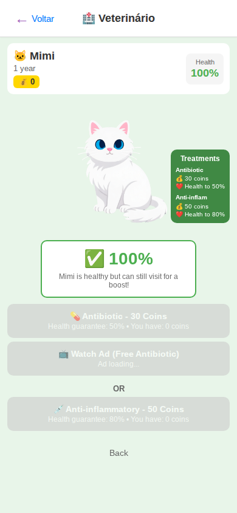

# VetScene

> Veterinarian care screen with health status, treatment options, and payment methods.
> Source: `src/screens/VetScene.tsx`



---

## Layout Structure

```
┌─────────────────────────────────┐
│           SafeAreaView          │
│      bg: #E8F5E9 (soft green)   │
│                                 │
│  ┌───────────────────────────┐  │
│  │  ScreenHeader             │  │
│  │  ← Voltar   🏥 Vet       │  │
│  └───────────────────────────┘  │
│                                 │
│  ┌───────────────────────────┐  │  ScrollView
│  │  Pet Info Header          │  │
│  │  [Name/Age/Money] [Health]│  │  white bg, rounded
│  └───────────────────────────┘  │
│                                 │
│  ┌───────────────────────────┐  │
│  │      PetRenderer          │  │  smaller pet
│  │                           │  │
│  │  ┌─────────────────┐     │  │
│  │  │ 🚨 75% Health   │     │  │  Status card (bordered)
│  │  │ "Needs checkup" │     │  │
│  │  └─────────────────┘     │  │
│  │              ┌─────────┐ │  │
│  │              │Treatments│ │  │  Benefits sidebar
│  │              │Antibiotic│ │  │
│  │              │Anti-infl.│ │  │
│  │              └─────────┘ │  │
│  └───────────────────────────┘  │
│                                 │
│  ┌───────────────────────────┐  │
│  │ 💊 Antibiotic - 50 Coins │  │  Pay button (green)
│  │ 📺 Watch Ad (Free)       │  │  Ad button (blue)
│  │          OR               │  │
│  │ 💉 Anti-inflam - 80 Coins│  │  Pay button (green)
│  └───────────────────────────┘  │
│                                 │
│  Back (link)                    │
└─────────────────────────────────┘
```

---

## Specifications

### Container
- **Background**: `#E8F5E9` (soft green - medical/healthy theme)
- **ScrollView**: full-height scrollable content

### Pet Info Header
- **Background**: `#ffffff`
- **Border radius**: `10px` (responsive)
- **Padding**: `10px` (responsive)
- **Layout**: row, `space-between`

#### Left Side
- **Pet name**: responsive titleSize, weight `bold`, color `#333`
- **Age**: `13px` (responsive), color `#666`
- **Money badge**:
  - Background: `#FFD700` (gold)
  - Padding: vertical `3px`, horizontal `8px`
  - Border radius: `6px`
  - Text: `13px` (responsive), weight `bold`, color `#333`

#### Health Badge (right)
- **Background**: `#f5f5f5`
- **Padding**: `8px` (responsive)
- **Border radius**: `8px`
- **Label**: `11px` (responsive), color `#666`
- **Value**: responsive titleSize, weight `bold`, color = urgency color

### Main Area
- **Position**: relative (for sidebar positioning)
- **Pet size**: PET_SIZE_SMALL (smaller than action screens)

### Health Status Card
- **Background**: `#ffffff`
- **Border**: `2px` solid = urgency color
- **Border radius**: `10px` (responsive)
- **Padding**: `12px` (responsive)
- **Width**: `70%`
- **Alignment**: center

#### Health Display
- **Layout**: row, centered
- **Emoji**: `🚨` / `⚠️` / `✅` based on status, `28px` (responsive)
- **Value**: `28px` (responsive), weight `bold`, color = urgency color

#### Urgency Message
- **Font**: `12px` (responsive), color `#666`
- **Margin top**: `6px`
- **Messages**:
  - Urgent: "{name} needs urgent medical attention!"
  - Suggested: "{name} could use a checkup."
  - Normal: "{name} is healthy but can still visit!"

### Benefits Sidebar
- **Position**: absolute, right `0`, top `25%`
- **Background**: `rgba(46, 125, 50, 0.9)` (dark green, semi-transparent)
- **Border radius**: `10px` (responsive)
- **Padding**: `8px` (responsive)
- **Max width**: `110px` (responsive)

#### Sidebar Content
- **Title**: "Treatments", responsive sidebarTitle, weight `700`, color `#fff`
- **Treatment name**: responsive sidebarText, weight `600`, color `#fff`
- **Details**: `10px` (responsive), color `#fff`
  - Cost in coins
  - Health guarantee percentage

### Treatment Buttons

#### Pay Button (Antibiotic / Anti-inflammatory)
- **Background**: `#4CAF50` (green)
- **Disabled**: bg `#ccc`, opacity `0.6`
- **Padding**: vertical `12px`, horizontal `16px` (responsive)
- **Border radius**: `10px`
- **Text**: responsive buttonText, weight `600`, color `#fff`
- **Subtext**: `12px` (responsive), color `#fff`, opacity `0.9`
  - Shows health guarantee and current coins

#### Watch Ad Button
- **Background**: `#2196F3` (blue)
- **Disabled**: bg `#ccc`, opacity `0.6`
- **Padding**: same as pay button
- **Text**: "📺 Watch Ad (Free Antibiotic)"
- **Loading text**: "⏳ Loading..."

#### OR Divider
- **Font**: `13px` (responsive), weight `600`, color `#666`
- **Alignment**: center
- **Margin vertical**: `6px`

### Back Link
- **Padding**: `8px` (responsive)
- **Text**: `14px` (responsive), color `#666`

---

## Urgency Color Logic

```
Health status → Color mapping:
- urgent (health < threshold)  → #EF5350 (red)
- suggested (moderate health)  → #FFA726 (orange)
- normal (healthy)             → #4CAF50 (green)
```

---

## Treatment Data

| Treatment | Cost | Health Guarantee |
|-----------|------|-----------------|
| Antibiotic | Configurable (gameBalance) | 50% |
| Anti-inflammatory | Configurable (gameBalance) | 80% |

---

## States

| State | Visual |
|-------|--------|
| Urgent health | Red border on status card, `🚨` emoji |
| Suggested | Orange border, `⚠️` emoji |
| Healthy | Green border, `✅` emoji |
| Can't afford | Pay button disabled (gray) |
| Ad not ready | Ad button disabled (gray), "Ad loading..." subtext |
| Processing | Buttons disabled, loading indicator |
