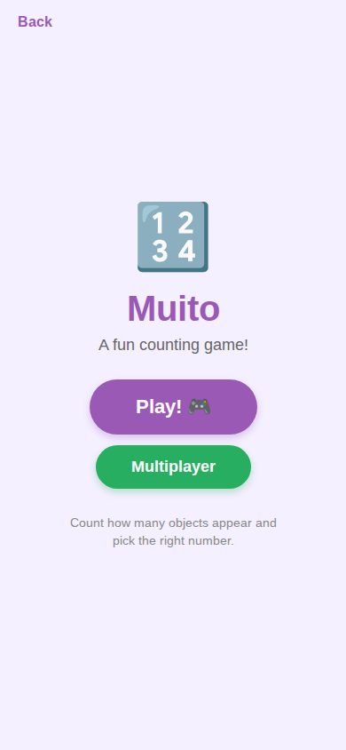
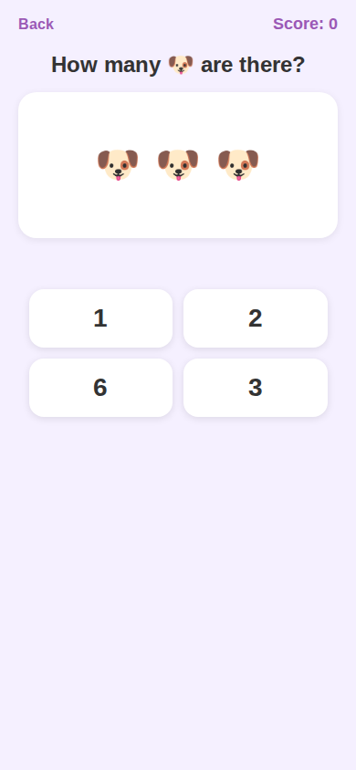

# Muito Game Screens

> Counting/number game with single-player and multiplayer modes.
> Sources: `src/screens/MuitoHomeScreen.tsx`, `src/screens/MuitoGameScreen.tsx`

| Home | Game |
|------|------|
|  |  |

---

## MuitoHomeScreen

### Layout Structure

```
┌──────────────────────────────┐
│         SafeAreaView         │
│    bg: #f5f0ff (brand-light) │
│                              │
│  ← Back                      │
│                              │
│  ┌──────────────────────┐    │
│  │       🔢 (72px)     │    │
│  │      "Muito"        │    │  40px, weight 800, #9b59b6
│  │     subtitle        │    │  18px, #666
│  │                      │    │
│  │  ┌──────────────┐   │    │
│  │  │ Best: 120    │   │    │  Score card (conditional)
│  │  └──────────────┘   │    │
│  │                      │    │
│  │  ┌──────────────┐   │    │
│  │  │    Play      │   │    │  bg: #9b59b6, pill shape
│  │  └──────────────┘   │    │
│  │                      │    │
│  │  ┌──────────────┐   │    │
│  │  │ Multiplayer  │   │    │  bg: #27ae60, pill shape
│  │  └──────────────┘   │    │
│  │                      │    │
│  │  "instructions..."   │    │  14px, #888
│  └──────────────────────┘    │
└──────────────────────────────┘
```

### Specs

#### Back Button
- **Padding**: horizontal `20px`, top `16px`
- **Text**: `16px`, weight `600`, color `#9b59b6`

#### Content Area
- **Layout**: centered both axes, padding horizontal `24px`
- **Offset**: marginTop `-40px` (visually centered)

#### Title
- **Emoji**: `🔢`, size `72px`, marginBottom `12px`
- **Title**: `40px`, weight `800`, color `#9b59b6`, marginBottom `8px`
- **Subtitle**: `18px`, color `#666`, center-aligned, marginBottom `28px`

#### Best Score Card
- **Background**: `#ffffff`
- **Border radius**: `16px`
- **Padding**: vertical `12px`, horizontal `28px`
- **Shadow**: offset `{0, 2}`, opacity `0.08`, radius `8`, elevation `3`
- **Label**: `14px`, weight `600`, color `#888`, uppercase, letterSpacing `1`
- **Value**: `32px`, weight `800`, color `#9b59b6`

#### Play Button
- **Background**: `#9b59b6`
- **Padding**: vertical `18px`, horizontal `52px`
- **Border radius**: `32px` (pill)
- **Shadow**: color `#9b59b6`, offset `{0, 4}`, opacity `0.3`, radius `8`, elevation `5`
- **Text**: `22px`, weight `700`, color `#ffffff`

#### Multiplayer Button
- **Background**: `#27ae60`
- **Padding**: vertical `14px`, horizontal `40px`
- **Border radius**: `32px` (pill)
- **Shadow**: color `#27ae60`, offset `{0, 4}`, opacity `0.3`
- **Margin top**: `12px`
- **Text**: `18px`, weight `700`, color `#ffffff`

#### Instructions
- **Font**: `14px`, color `#888`, center-aligned
- **Margin top**: `28px`, maxWidth `260px`, lineHeight `20px`

---

## MuitoGameScreen

### Layout Structure

```
┌──────────────────────────────┐
│         SafeAreaView         │
│    bg: #f5f0ff               │
│                              │
│  ← Back        Score: 30     │  Header
│                              │
│  "How many 🍎?"             │  Question
│                              │
│  ┌──────────────────────┐    │
│  │  🍎 🍎 🍎 🍎        │    │  Objects card (white)
│  │     🍎 🍎            │    │  Emoji grid
│  └──────────────────────┘    │
│                              │
│  "Correct!" / "Wrong!"      │  Feedback
│                              │
│  ┌──────┐  ┌──────┐         │  Option buttons
│  │  4   │  │  5   │         │  2x2 grid
│  ├──────┤  ├──────┤         │
│  │  6   │  │  7   │         │
│  └──────┘  └──────┘         │
└──────────────────────────────┘
```

### Specs

#### Header
- **Layout**: row, `space-between`, paddingHorizontal `20px`, paddingTop `16px`
- **Back text**: `16px`, weight `600`, color `#9b59b6`
- **Score text**: `18px`, weight `700`, color `#9b59b6`

#### Question
- **Font**: `24px`, weight `700`, color `#333`
- **Alignment**: center
- **Margin**: top `12px`, bottom `16px`

#### Objects Card
- **Background**: `#ffffff`
- **Border radius**: `20px`
- **Margin horizontal**: `20px`
- **Padding**: `24px`
- **Min height**: `160px`
- **Shadow**: offset `{0, 2}`, opacity `0.08`, radius `8`, elevation `3`

##### Objects Grid
- **Layout**: row, wrapping, centered
- **Gap**: `16px`
- **Emoji size**: `36px`

#### Feedback Container
- **Height**: `36px` (fixed for layout stability)
- **Margin top**: `12px`
- **Correct**: `20px`, weight `700`, color `#27ae60`
- **Wrong**: `20px`, weight `700`, color `#e74c3c`

#### Option Buttons
- **Layout**: row, wrapping, centered, gap `12px`
- **Margin top**: `8px`, paddingHorizontal `20px`

##### Individual Option
- **Width**: `45%`
- **Padding vertical**: `16px`
- **Border radius**: `16px`
- **Background**: `#ffffff`
- **Shadow**: offset `{0, 2}`, opacity `0.1`, radius `8`, elevation `3`

##### Option States
| State | Background | Text Color | Opacity |
|-------|-----------|------------|---------|
| Default | `#ffffff` | `#333` | 1.0 |
| Selected (correct) | `#27ae60` | `#ffffff` | 1.0 |
| Selected (wrong) | `#e74c3c` | `#ffffff` | 1.0 |
| Dimmed (unselected after answer) | `#ffffff` | `#333` | 0.4 |

- **Text**: `28px`, weight `700`

---

## Game Mechanics

- Puzzle difficulty scales with rounds:
  - Rounds 1-3: 2-4 objects
  - Rounds 4-7: 3-6 objects
  - Rounds 8+: 4-9 objects
- 4 answer options (1 correct, 3 wrong)
- +10 score per correct answer
- Auto-advance after 1500ms
