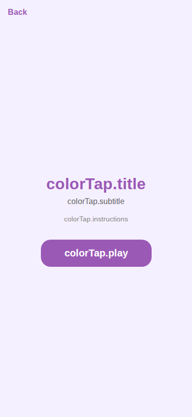

# Color Tap Game Screens

> Color matching game. Home screen uses native UI; game screen uses HTML artifact.
> Sources: `src/screens/ColorTapHomeScreen.tsx`, `src/screens/ColorTapGameScreen.tsx`



---

## ColorTapHomeScreen

### Layout Structure

```
┌──────────────────────────────┐
│         SafeAreaView         │
│    bg: #f5f0ff (brand-light) │
│                              │
│  ← Back                      │
│                              │
│  ┌──────────────────────┐    │
│  │  "Color Tap"          │    │  32px, weight 800, #9b59b6
│  │  subtitle             │    │  16px, #666
│  │  instructions         │    │  14px, #888
│  │                       │    │
│  │  ┌────────────────┐  │    │
│  │  │ Best Score     │  │    │  White card (conditional)
│  │  │    120         │  │    │  28px, weight 800, #9b59b6
│  │  └────────────────┘  │    │
│  │                       │    │
│  │  ┌────────────────┐  │    │
│  │  │     Play       │  │    │  bg: #9b59b6
│  │  └────────────────┘  │    │
│  └──────────────────────┘    │
└──────────────────────────────┘
```

### Specs

#### Container
- **Background**: `#f5f0ff`

#### Back Button
- **Padding**: `16px`
- **Alignment**: flex-start
- **Text**: `16px`, weight `600`, color `#9b59b6`

#### Content Area
- **Layout**: centered both axes
- **Padding horizontal**: `32px`

#### Title
- **Font**: `32px`, weight `800`, color `#9b59b6`
- **Margin bottom**: `8px`
- **Alignment**: center

#### Subtitle
- **Font**: `16px`, color `#666`
- **Margin bottom**: `16px`

#### Instructions
- **Font**: `14px`, color `#888`
- **Line height**: `20px`
- **Margin bottom**: `32px`

#### Score Card
- **Background**: `#ffffff`
- **Border radius**: `16px`
- **Padding**: `20px`
- **Min width**: `140px`
- **Margin bottom**: `32px`
- **Shadow**: offset `{0, 2}`, opacity `0.08`, radius `8`, elevation `3`
- **Label**: `14px`, color `#888`, marginBottom `4px`
- **Value**: `28px`, weight `800`, color `#9b59b6`

#### Play Button
- **Background**: `#9b59b6`
- **Border radius**: `20px`
- **Padding**: vertical `16px`, horizontal `48px`
- **Text**: `20px`, weight `bold`, color `#ffffff`

---

## ColorTapGameScreen

The game screen uses an **HTML artifact** loaded via `ArtifactGameAdapter` component.
The actual game UI is rendered in a WebView and is not described in this design system.

The adapter provides:
- Score communication between WebView and React Native
- Back navigation handling
- Loading states
