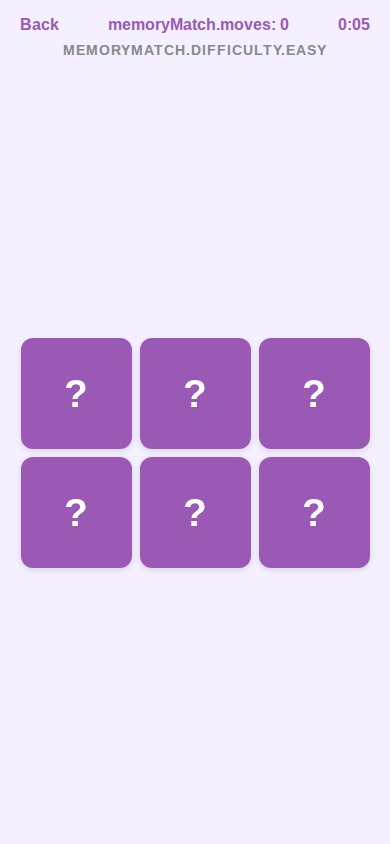

# Memory Match Game Screens

> Card-flipping memory game with difficulty selection and scoring.
> Sources: `src/screens/MemoryMatchHomeScreen.tsx`, `src/screens/MemoryMatchGameScreen.tsx`

| Home | Game |
|------|------|
|  |  |

---

## MemoryMatchHomeScreen

### Layout Structure

```
┌──────────────────────────────┐
│         SafeAreaView         │
│    bg: #f5f0ff               │
│                              │
│  ← Back                      │
│                              │
│  ┌──────────────────────┐    │
│  │     🧠 (72px)       │    │
│  │   "Memory Match"    │    │  36px, weight 800, #9b59b6
│  │     subtitle        │    │  18px, #666
│  │                      │    │
│  │  [Easy][Medium][Hard]│    │  Difficulty pills
│  │                      │    │
│  │  ┌──────────────┐   │    │
│  │  │ Best: 150    │   │    │  Score card
│  │  └──────────────┘   │    │
│  │                      │    │
│  │  ┌──────────────┐   │    │
│  │  │    Play      │   │    │  bg: #9b59b6, pill
│  │  └──────────────┘   │    │
│  │                      │    │
│  │  instructions...     │    │
│  └──────────────────────┘    │
└──────────────────────────────┘
```

### Difficulty Selector

#### Container
- **Layout**: row, gap `10px`, marginBottom `24px`

#### Difficulty Button
- **Padding**: vertical `10px`, horizontal `20px`
- **Border radius**: `20px` (pill)
- **Background**: `#ffffff`
- **Border**: `2px` solid `#e0d4f0`

#### Selected Difficulty
- **Background**: `#9b59b6`
- **Border color**: `#9b59b6`
- **Text color**: `#ffffff` (instead of `#9b59b6`)

#### Text
- **Font**: `15px`, weight `600`
- **Default color**: `#9b59b6`
- **Selected color**: `#ffffff`

### Other Elements
Same pattern as MuitoHomeScreen:
- Title: `36px` (slightly smaller than Muito's 40px)
- Best Score Card, Play Button, Instructions: identical specs

---

## MemoryMatchGameScreen

### Layout Structure

```
┌──────────────────────────────┐
│         SafeAreaView         │
│    bg: #f5f0ff               │
│                              │
│  ← Back   Moves: 5   1:23   │  Header
│                              │
│         MEDIUM               │  Difficulty label
│                              │
│  ┌──────────────────────┐    │
│  │  ┌──┐ ┌──┐ ┌──┐     │    │
│  │  │? │ │🐱│ │? │     │    │  Card grid
│  │  └──┘ └──┘ └──┘     │    │
│  │  ┌──┐ ┌──┐ ┌──┐     │    │
│  │  │? │ │? │ │🐶│     │    │
│  │  └──┘ └──┘ └──┘     │    │
│  └──────────────────────┘    │
│                              │
│  ┌──────────────────────┐    │  Game Over overlay
│  │  "Congratulations!"  │    │  (conditional)
│  │  ★★★                 │    │
│  │  Moves: 5            │    │
│  │  Time: 1:23          │    │
│  │  Score: 150           │    │
│  │  [Play Again]         │    │
│  │  Back                 │    │
│  └──────────────────────┘    │
└──────────────────────────────┘
```

### Specs

#### Header
- **Layout**: row, `space-between`, paddingHorizontal `20px`
- **Back text**: `16px`, weight `600`, color `#9b59b6`
- **Stats**: `16px`, weight `700`, color `#9b59b6`

#### Difficulty Label
- **Font**: `14px`, weight `600`, color `#888`
- **Alignment**: center
- **Text transform**: uppercase
- **Letter spacing**: `1`
- **Margin bottom**: `12px`

#### Card Grid
- **Layout**: centered, paddingHorizontal `20px`
- **Row gap**: `8px`
- **Card gap**: `8px`

##### Grid Configurations

| Difficulty | Columns | Rows | Pairs |
|-----------|---------|------|-------|
| Easy | 3 | 2 | 3 |
| Medium | 4 | 3 | 6 |
| Hard | 4 | 4 | 8 |

##### Card (face down)
- **Background**: `#9b59b6` (brand purple)
- **Border radius**: `12px`
- **Size**: calculated to fit screen width
- **Shadow**: offset `{0, 2}`, opacity `0.12`, radius `6`, elevation `3`
- **Text**: "?", `{cardSize * 0.35}px`, weight `800`, color `#ffffff`

##### Card (matched)
- **Background**: `#e8f5e9` (light green)
- **Border**: `2px` solid `#27ae60`

##### Card (flipped, showing emoji)
- Emoji icon at `{cardSize * 0.45}px` size

##### Flip Animation
- Animated `rotateY` interpolation
- Duration: `250ms`
- Unmatched cards flip back after `800ms`

#### Game Over Overlay
- **Backdrop**: `rgba(0, 0, 0, 0.5)`
- **Card**: white, border radius `24px`, padding `32px`, maxWidth `340px`
- **Shadow**: offset `{0, 8}`, opacity `0.15`, radius `20`, elevation `10`

##### Overlay Content
- **Title**: `28px`, weight `800`, color `#9b59b6`
- **Stars**: `40px`, color `#f1c40f` (gold)
  - `★` for earned, `☆` for unearned
  - 3 stars: moves <= pairs + 1
  - 2 stars: moves <= pairs * 2
  - 1 star: otherwise
- **Stats**: `16px`, weight `500`, color `#666`
- **Score**: `22px`, weight `800`, color `#9b59b6`

##### Play Again Button
- **Background**: `#9b59b6`
- **Padding**: vertical `14px`, horizontal `40px`
- **Border radius**: `28px` (pill)
- **Shadow**: same as home play button
- **Text**: `18px`, weight `700`, color `#ffffff`

##### Back Button (overlay)
- **Text**: `16px`, weight `600`, color `#9b59b6`
- **Padding**: vertical `10px`, horizontal `24px`
