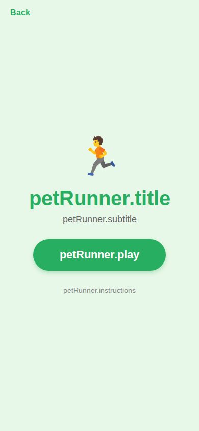

# Pet Runner Game Screens

> Side-scrolling runner game with tap-to-jump mechanics, obstacles, and coins.
> Sources: `src/screens/PetRunnerHomeScreen.tsx`, `src/screens/PetRunnerGameScreen.tsx`



---

## PetRunnerHomeScreen

### Layout Structure

```
┌──────────────────────────────┐
│         SafeAreaView         │
│   bg: #e8f8e8 (light green)  │
│                              │
│  ← Back                      │  #27ae60 (green accent)
│                              │
│  ┌──────────────────────┐    │
│  │     🏃 (72px)       │    │
│  │   "Pet Runner"      │    │  40px, weight 800, #27ae60
│  │     subtitle        │    │  18px, #666
│  │                      │    │
│  │  ┌──────────────┐   │    │
│  │  │ Best: 250    │   │    │  Score card
│  │  └──────────────┘   │    │
│  │                      │    │
│  │  ┌──────────────┐   │    │
│  │  │    Play      │   │    │  bg: #27ae60, pill
│  │  └──────────────┘   │    │
│  │                      │    │
│  │  instructions...     │    │
│  └──────────────────────┘    │
└──────────────────────────────┘
```

### Unique Theme: Green Accent

Unlike other mini-games that use `#9b59b6` (purple), Pet Runner uses `#27ae60` (green):

| Element | Other Games | Pet Runner |
|---------|-----------|------------|
| Background | `#f5f0ff` | `#e8f8e8` |
| Accent color | `#9b59b6` | `#27ae60` |
| Back text | `#9b59b6` | `#27ae60` |
| Score value | `#9b59b6` | `#27ae60` |
| Play button | `#9b59b6` | `#27ae60` |
| Shadow color | `#9b59b6` | `#27ae60` |

### Specs

All element sizing and layout identical to MuitoHomeScreen, just with green palette.

---

## PetRunnerGameScreen

### Layout Structure

```
┌──────────────────────────────────┐
│            SafeAreaView          │
│       bg: #87CEEB (sky blue)     │
│                                  │
│  ← Back    🪙 5     120m        │  Header (white text)
│                                  │
│  ┌────────────────────────────┐  │
│  │         Game Area          │  │  Pressable (tap to jump)
│  │                            │  │
│  │  🐱 (pet)                 │  │  40px, positioned left 15%
│  │                            │  │
│  │         🪙                │  │  Coins at various heights
│  │                   🪵      │  │  Obstacles on ground
│  │                            │  │
│  │  ┌────────────────────┐   │  │
│  │  │  🟤 Ground (brown) │   │  │  80px height
│  │  │  ─── Green border  │   │  │  4px top border
│  │  └────────────────────┘   │  │
│  └────────────────────────────┘  │
│                                  │
│  ┌────────────────────────────┐  │  Game Over overlay
│  │    "Game Over"             │  │  (conditional)
│  │    Distance: 120m          │  │
│  │    Coins: 5                │  │
│  │    Score: 170              │  │
│  │    NEW BEST!               │  │
│  │    [Play Again]            │  │
│  │    Back                    │  │
│  └────────────────────────────┘  │
└──────────────────────────────────┘
```

### Specs

#### Container
- **Background**: `#87CEEB` (sky blue)

#### Header
- **Layout**: row, `space-between`, zIndex `10`
- **Padding**: horizontal `20px`, top `16px`, bottom `8px`
- **Back text**: `16px`, weight `600`, color `#ffffff`
- **Stats**: `18px`, weight `700`, color `#ffffff`

#### Game Area
- **Layout**: `flex: 1`, relative positioning
- **Overflow**: hidden
- **Interaction**: `Pressable` - tap anywhere to jump

#### Start Overlay (before game starts)
- **Position**: absolute, full area, centered, zIndex `5`
- **Pet emoji**: `🐱`, `48px`, marginBottom `16px`
- **Text**: "Tap to Start", `22px`, weight `700`, color `#ffffff`
- **Text shadow**: `rgba(0, 0, 0, 0.3)`, offset `{1, 1}`, radius `4`

#### Pet
- **Emoji**: `🐱`
- **Size**: `40px`
- **Position**: absolute, left `15%` of screen width
- **Y position**: physics-based (gravity + jump velocity)

#### Physics Constants
| Property | Value |
|----------|-------|
| Gravity | `0.8` |
| Jump velocity | `-14` |
| Base speed | `4` |
| Max speed multiplier | `2.5x` |
| Speed increase interval | every 300 frames |

#### Obstacles
- **Emojis**: `🪵`, `🪨`, `🧱` (random selection)
- **Size**: `36x36px`
- **Position**: ground level, moving left

#### Coins
- **Emoji**: `🪙`
- **Size**: `28px`
- **Heights**: ground level, +40px, +80px above ground
- **Movement**: same speed as obstacles

#### Ground
- **Position**: absolute, bottom
- **Height**: `80px`
- **Background**: `#8B4513` (brown)
- **Top border**: `4px` solid `#228B22` (green grass line)

### Game Over Overlay

Same structure as MemoryMatch overlay with green theme:

- **Title**: `28px`, weight `800`, color `#e74c3c` (red - "Game Over")
- **Stats**: `16px`, weight `500`, color `#666`
- **Score**: `22px`, weight `800`, color `#27ae60` (green)
- **New Best text**: `18px`, weight `800`, color `#f1c40f` (gold)

#### Play Again Button
- **Background**: `#27ae60` (green, not purple)
- **Padding**: vertical `14px`, horizontal `40px`
- **Border radius**: `28px`
- **Shadow**: color `#27ae60`
- **Text**: `18px`, weight `700`, color `#ffffff`

#### Back Button
- **Text**: `16px`, weight `600`, color `#27ae60`

---

## Scoring

```
finalScore = floor(distance) + (coinCount * 10)
```

---

## States

| State | Visual |
|-------|--------|
| Ready | Start overlay with pet emoji + "Tap to Start" |
| Playing | Pet running, obstacles/coins spawning, HUD showing |
| Game Over | Overlay with stats, play again / back options |
