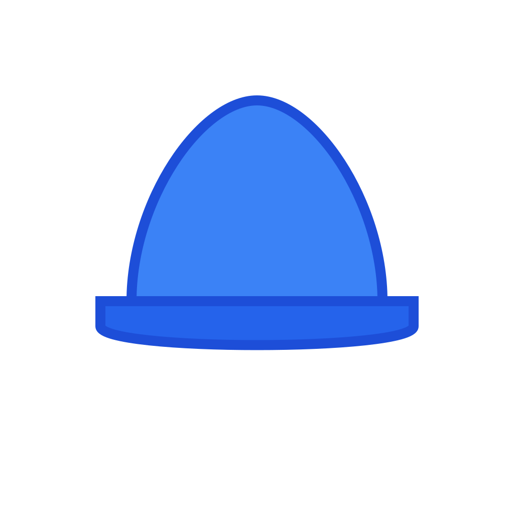
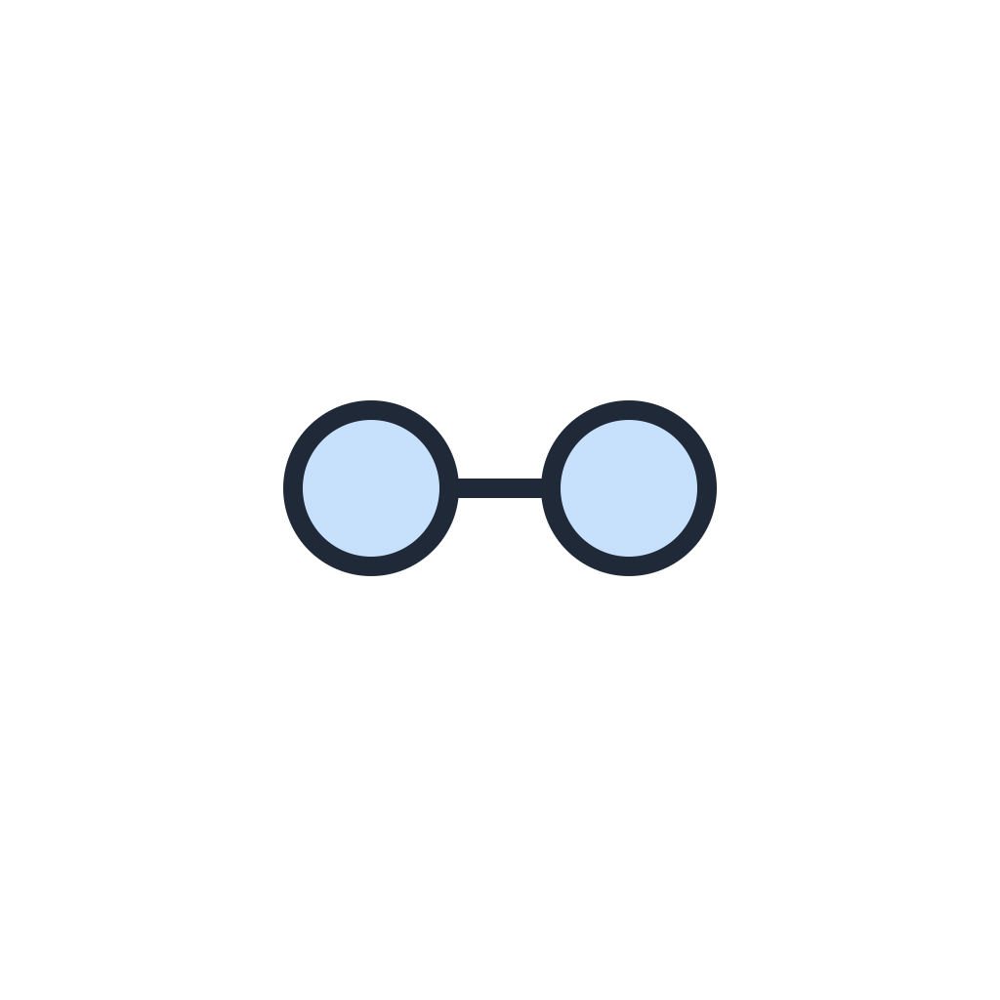
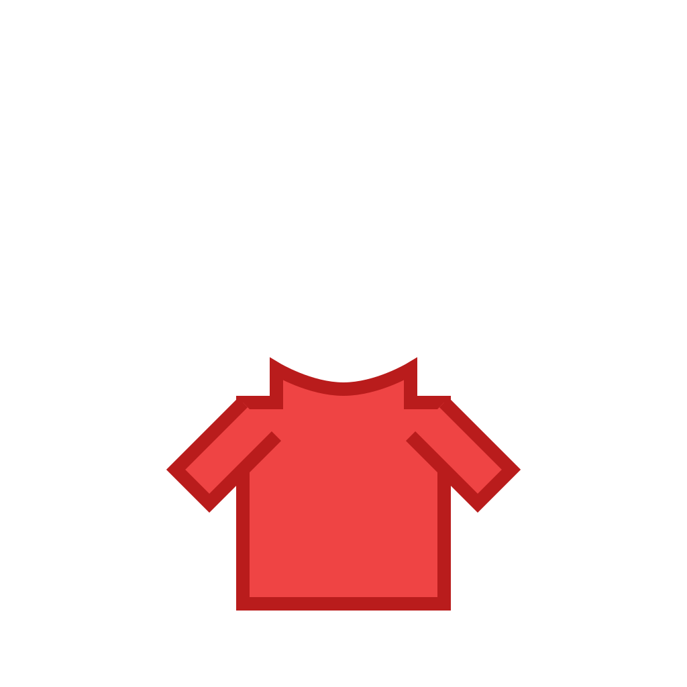
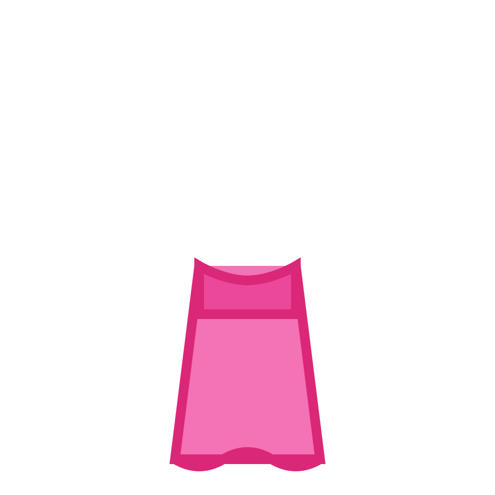
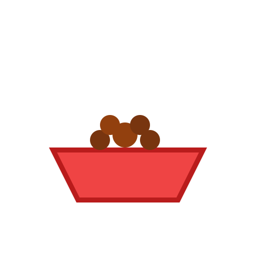
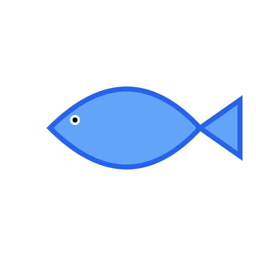
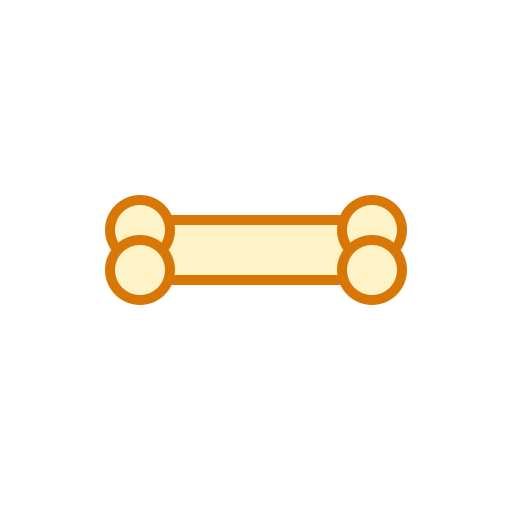
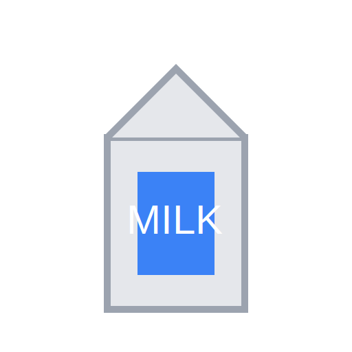
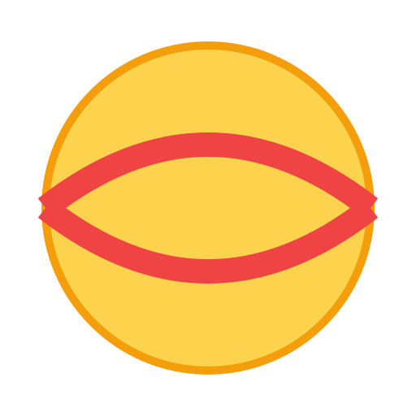

# Needed Sprites

This document lists the sprites that need to be added to the project to complete the visual assets for items.
SVG placeholders have been generated for these items.

## 1. Clothing Items (High Priority)
These items are defined in `src/data/clothingItems.ts`.

**Location:** `assets/sprites/clothes/`
**File Format:** SVG (Generated) / PNG (Goal)

| ID | Filename | Preview | Description | Slot |
|----|----------|---------|-------------|------|
| `hat_blue` | `hat_blue.svg` |  | A blue version of the existing `hat_red.png`. | Head |
| `crown` | `crown.svg` |  | A golden crown fit for a pet. | Head |
| `eyes_star` | `eyes_star.svg` |  | Eyes with star shapes or sparkles, expressing excitement. | Eyes |
| `glasses` | `glasses.svg` |  | A pair of glasses (sunglasses or reading glasses). | Eyes |
| `shirt_red` | `shirt_red.svg` |  | A red version of the existing `shirt_blue.png`. | Torso |
| `dress_pink` | `dress_pink.svg` |  | A cute pink dress. | Torso |
| `paws_socks` | `paws_socks.svg` |  | Little socks for the pet's paws. | Paws |

## 2. Food Items (Optional)
Replacing emojis in `src/data/foodItems.ts` with sprites.

**Location:** `assets/sprites/food/`

| ID | Filename | Preview | Description |
|----|----------|---------|-------------|
| `kibble` | `kibble.svg` |  | A bowl of dry pet food. |
| `fish` | `fish.svg` |  | A fresh fish. |
| `treat` | `treat.svg` |  | A bone or a cookie treat. |
| `milk` | `milk.svg` |  | A bowl or carton of milk. |

## 3. Play Items (Optional)
Replacing emojis in `src/data/playActivities.ts` with sprites.

**Location:** `assets/sprites/toys/`

| ID | Filename | Preview | Description |
|----|----------|---------|-------------|
| `yarn_ball` | `yarn_ball.svg` |  | A ball of yarn (colors like red or blue). |
| `small_ball` | `small_ball.svg` |  | A small bouncy ball or tennis ball. |

## Technical Notes
- **Transparency:** All sprites must have a transparent background.
- **Style:** The style should match the existing vector/cartoon style of the base pets and current clothes.
- **Base Models:**
    - Cats: `assets/sprites/cats/cat_base.png` (768x768)
    - Dogs: `assets/sprites/dogs/dog_brown.png` (Dimensions likely similar)
    - Note that clothing assets (1024x1024) are larger than the base models, likely to allow for scaling and positioning adjustments.
