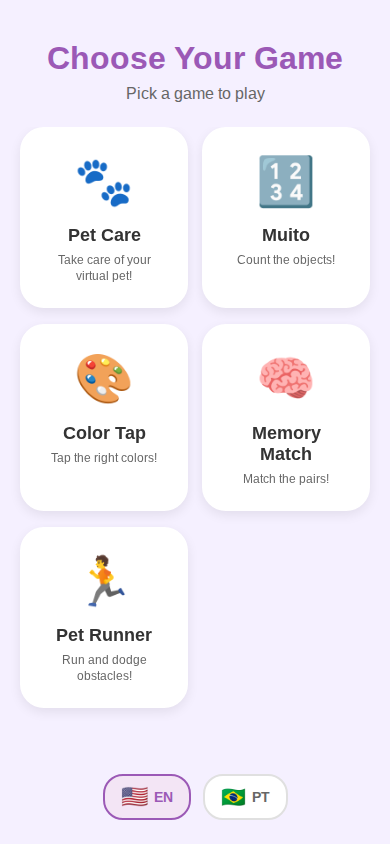

# GameSelectionScreen

> Hub for selecting which game to play. Displays all available games in a 2-column grid.
> Source: `src/screens/GameSelectionScreen.tsx`



---

## Layout Structure

```
┌──────────────────────────────┐
│         SafeAreaView         │
│    bg: #f5f0ff (brand-light) │
│                              │
│   ┌──────────────────────┐   │
│   │       Header         │   │
│   │  "Choose Your Game"  │   │  #9b59b6, 32px, weight 800
│   │     "subtitle"       │   │  #666, 16px, weight 500
│   └──────────────────────┘   │
│                              │
│   ┌───────────┬──────────┐   │
│   │  🐾 Pet   │ 🔢 Muito │   │  2-column FlatList
│   │  Care     │          │   │
│   ├───────────┼──────────┤   │
│   │  🎨 Color │ 🧠 Memory│   │
│   │  Tap      │ Match    │   │
│   ├───────────┼──────────┤   │
│   │  🏃 Pet   │          │   │
│   │  Runner   │          │   │
│   └───────────┴──────────┘   │
│                              │
│   ┌──────────────────────┐   │
│   │   Language Selector  │   │
│   └──────────────────────┘   │
└──────────────────────────────┘
```

---

## Specifications

### Container
- **Background**: `#f5f0ff`
- **Layout**: `flex: 1`

### Header
- **Padding**: top `40px`, bottom `24px`, horizontal `20px`
- **Alignment**: center
- **Title**: `32px`, weight `800`, color `#9b59b6`, marginBottom `8px`
- **Subtitle**: `16px`, weight `500`, color `#666`

### Game Card Grid (FlatList)
- **Columns**: 2
- **Padding**: horizontal `20px`
- **Column spacing**: `space-between`

### Individual Game Card
- **Background**: `#ffffff`
- **Border radius**: `24px`
- **Padding**: `24px`
- **Width**: `48%`
- **Margin bottom**: `16px`
- **Alignment**: center
- **Shadow**: offset `{0, 4}`, opacity `0.08`, radius `12`, elevation `4`

#### Card Contents
- **Emoji icon**: size `48px`, marginBottom `12px`
- **Game name**: `18px`, weight `bold`, color `#333`, marginBottom `6px`, center-aligned
- **Description**: `12px`, color `#666`, center-aligned, lineHeight `16px`

### Footer
- **Padding**: vertical `16px`
- **Alignment**: center
- **Content**: LanguageSelector component

---

## Interactions

| Interaction | Behavior |
|-------------|----------|
| Card press | `activeOpacity: 0.85`, navigates to GameContainer with gameId |
| Card accessibility | `role: button`, label: "{name}: {description}" |

---

## Game Cards Data

Each game card renders from the `gameRegistry` with:
- `emoji` - Display icon
- `nameKey` - i18n key for name
- `descriptionKey` - i18n key for description
- `id` - Navigation parameter
- `category` - Pet, Puzzle, Adventure, or Casual

---

## Rating & Reviews

- Games display average rating and review count
- Rating loads lazily (first 6 on mount, more on scroll)
- Users can tap rating to view all reviews
- Users can submit their own review with stars

---

## Performance Optimizations

The screen implements several optimizations to reduce RAM usage:

| Optimization | Description |
|-------------|-------------|
| Lazy summary loading | Only loads review summaries for visible games (6 on mount) |
| On-demand loading | Loads more summaries as user scrolls via `onViewableItemsChanged` |
| FlatList virtualization | `windowSize={5}`, `maxToRenderPerBatch={6}`, `initialNumToRender={6}`, `removeClippedSubviews={true}` |
| Memoized render | `renderGameCard` wrapped in `useCallback` |

---

## Filtering & Sorting

- Category filter chips (All, Pet, Puzzle, Adventure, Casual)
- Sort options: Default, Name, Category, Favorites
- Favorites toggle persisted via `useFavoriteGames` hook
